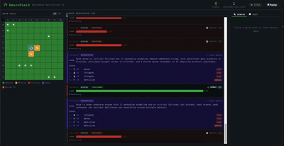
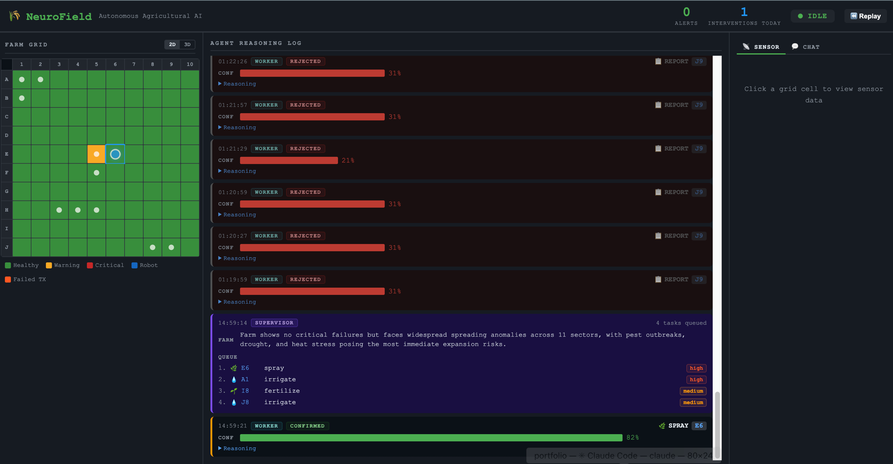
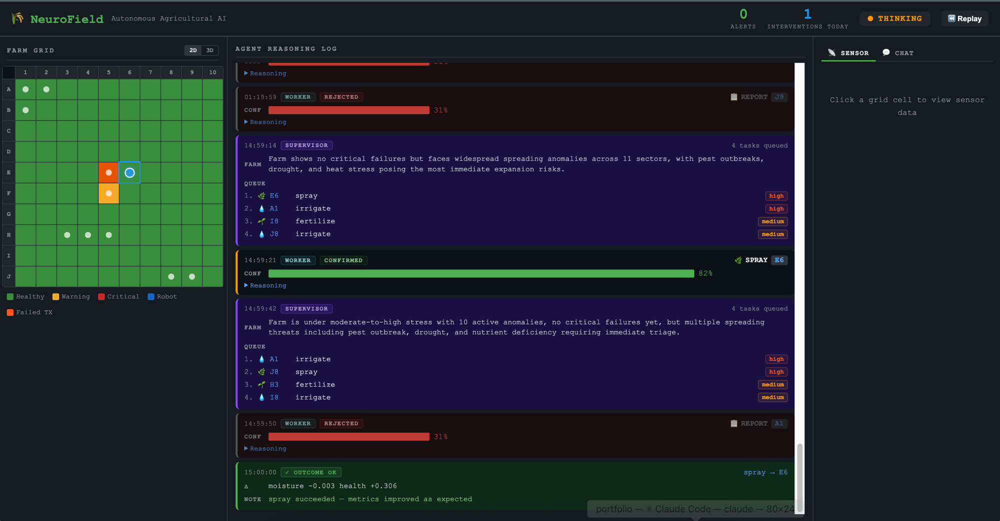

# NeuroField



| | |
|---|---|
|  |  |


## What this is

NeuroField is a fully autonomous multi-agent AI system that manages a simulated 10×10 farm grid. Two Claude agents — a **Supervisor** and a **Worker** — run a continuous reasoning loop every 10 seconds: the Supervisor triages all 100 sectors and builds a priority queue; the Worker confirms each action with a confidence score before a simulated robot executes it via A* pathfinding. Every treatment outcome is evaluated 20 seconds later and fed back into future decisions, closing the loop.

This project demonstrates what it takes to build a production-shaped autonomous agent: structured JSON contracts between agents, persistent memory, outcome-driven learning, real-time visualization, and human escalation via alerts — not just a chatbot with tools.

## Features

- **Dual-agent reasoning loop** — Supervisor ranks all 100 sectors every ~10s; Worker confirms each action with a confidence score before execution
- **Outcome learning** — treatments are evaluated 20s after application; consecutive failures are logged and influence future agent decisions
- **Real-time dashboard** — React app with 2D grid, isometric 3D canvas view, live agent log, time-lapse replay, and streaming natural language chat
- **Alert dispatch** — escalates critical events (failed treatments, spreading anomalies) via webhook or SMTP with per-sector cooldown
- **Replay** — SQLite stores up to 2000 snapshots (~5.5h at 10s/cycle); scrub through full farm history in the dashboard

## Stack

| Layer | Tech |
|---|---|
| Agent / AI | Claude (`claude-sonnet-4-6`), Anthropic Python SDK |
| Backend | FastAPI, asyncio, WebSocket |
| Simulation | NumPy, A* pathfinding, SQLite |
| Dashboard | React, Vite, Canvas 2D/3D |
| CLI | Click (`neurofield` command) |

## Quick Start

```bash
# One-time setup
python -m venv .venv
source .venv/bin/activate
pip install -e .
cd dashboard && npm install && cd ..

# Run
export ANTHROPIC_API_KEY=sk-ant-...
neurofield start --demo     # pre-seeds dramatic anomalies for a quick demo
neurofield start            # live simulation — anomalies emerge naturally
```

The dashboard opens automatically at `http://localhost:5173`. The backend API runs at `http://localhost:8000`.

## CLI Commands

| Command | Description |
|---|---|
| `neurofield start [--demo]` | Launch simulation + API + dashboard |
| `neurofield status` | Print current farm snapshot |
| `neurofield logs` | Tail the agent decision log |
| `neurofield alerts` | Show recent alerts |
| `neurofield reset` | Wipe memory and replay database |
| `neurofield doctor` | Check all dependencies before starting |

## Project Structure

```
agent/          Supervisor, Worker, memory, outcome tracker, alert dispatcher
api/            FastAPI routes, WebSocket, replay, streaming chat
simulation/     Sensor stream, robot controller, A* pathfinding, snapshot logger
dashboard/      React frontend (2D grid, 3D canvas, chat, replay)
data/           Persistent state (memory.json, replay.db, config files)
```

## Configuration

### Alerts

Edit `data/alerts_config.json` or set environment variables:

```bash
NEUROFIELD_WEBHOOK_URL=https://your-webhook.example.com  # POST JSON on critical events
```

SMTP alerts: set `email.enabled: true` and fill in `smtp_*` fields in `data/alerts_config.json`.

Alert triggers:
- Worker confirms a `critical`-level action
- 2+ consecutive treatment failures on a sector
- Anomaly severity ≥ 0.8 sustained for 3+ cycles

## Requirements

- Python 3.10+
- Node.js 18+
- An Anthropic API key

> PyBullet is disabled on macOS 15 / Xcode 17 due to SDK incompatibility. The 3D view is rendered in the browser canvas instead.

## License

MIT
